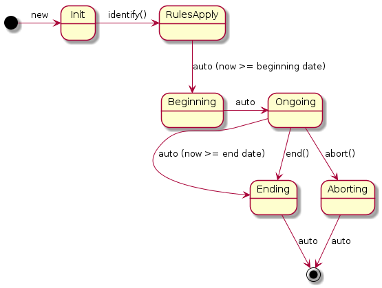

# 1.0 What are business situations

A business situation is a set of circumstances that pertain directly and significantly to the success of a business. A real business situation \(a crisis situation, a detected situation, a planned promotion situation, an active promotion situation\) often requires an action when the situation begins, is ongoing, or eventually ends.

A business situation must contain a start date. An end date is not mandatory, and it can involve entities, events, and concepts. A situation is likely to, but does not have to, begin at the present moment \(`now`\) and can be ongoing for a specified interval.

Business situations help you to identify, detect, and be notified of circumstances that are of special interest. Notification that a business situation occurred can be sent at the beginning, during, or at the end of the situation interval.

After a business situation is identified, its state is managed by the rule engine. The following diagram shows that when a rule identifies a business situation, the situation is initialized, and its state is updated. 

If the beginning date of that situation is not in the future, the state is set to `beginning` and `ongoing` at the same time point. The rules that match the business situation in a `beginning` or `ongoing` state immediately apply. If the business situation includes an end date, the rule engine creates a schedule to process its termination.

  
 
A business situation can be used to represent:
- a regular situation: ongoing promotion, open shop, bank holidays
- a detection: detecting a missing event,
- an aggregation: computing the average amount during a promotion.

In addition, it business situations can support:
- a fixed temporal interval: beginning at midnight, ending at noon,
- an event interval: beginning when a patient admission occurs, ending when a patient release occurs,
- a sliding event interval: beginning when a heartbeat occurs, ending 1 mn after,
- a mix of those.

[ **Next**](../docs/tsk_dsi_bs_enable.md)

[ **Back to table of contents**](../README.md)

