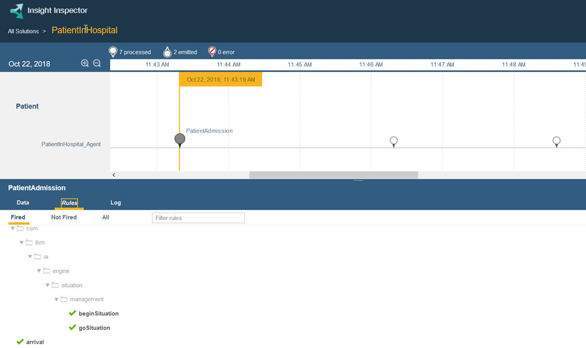
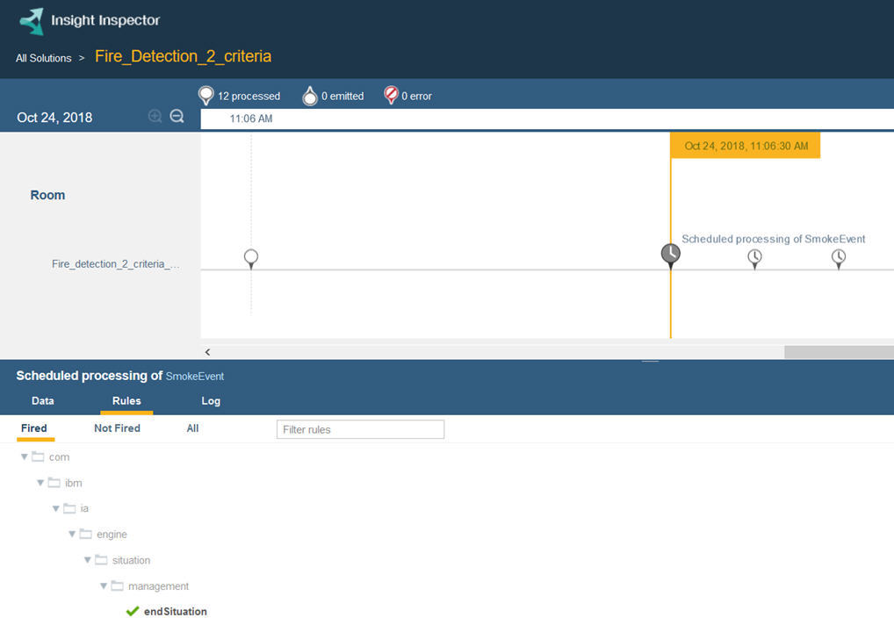

# 2.6 How to test your business situations

Business situations are not visible to the `TestDriver` class, so tests need to rely on event processing and the affected state of the entities.

Use Insight Inspector to validate your rule agents that experiment with business situations. If rules have conditions that include tests on business situations and the events are processed, it confirms that the rule engine is also processing the business situations.

Create event sequences and scenarios to test your rule agents that identify your business situations. The processed events in a rule agent timeline show when a business situation is initialized and begins in the Fired Rules tab.

The processed events in a rule agent timeline also show when a business situation is ended in the Fired Rules tab.

[ **Next**](../patientInHospital/patient.md)

[ **Back to table of contents**](../README.md)

