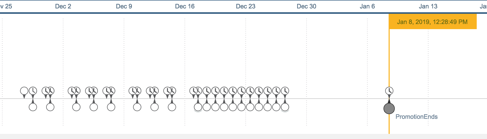
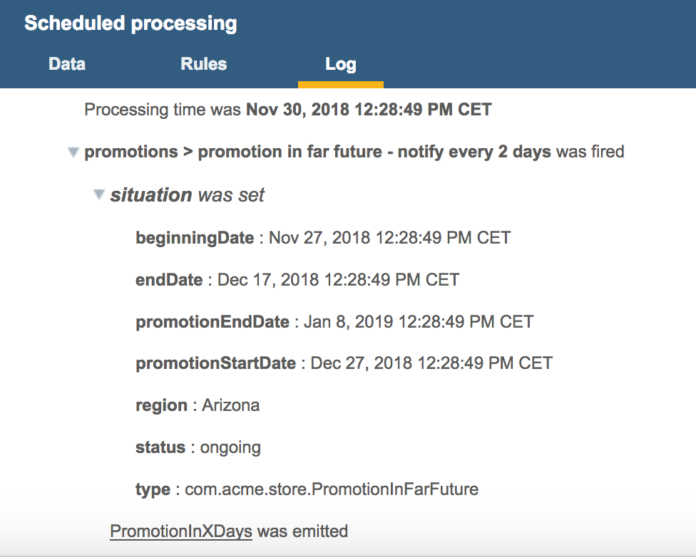

# Promotion in store example

In this example, the goal is to show how to handle a business situation that follows a business situation. It also shows how to emit a notification while a business situation is ongoing.

An event is used to announce a promotion that has a start date and an end date. Three business situations are identified to be at play.

-   A promotion in far future, which goes from the triggering event to 10 days before the beginning of the promotion.
-   A promotion in near future, which follows the promotion in far future situation and is ongoing until the beginning of the planned promotion.
-   A promotion ongoing.

The projects for the example solution can be found in the folder **[promotion](../promotion)**.

1.   Define the classes for the business situations. 
The situations have an ID called the `region`. 
They also contain some information that needs to be passed on to the next business situation:

```BMD
a promotion ongoing is a business situation identified by a region.

a promotion planned is a business situation identified by a region.
a promotion planned has a promotion end date (date & time).

a promotion in far future is a promotion planned.
a promotion in far future has a promotion start date (date & time).

a promotion in near future is a promotion planned.
```

2.   Add rules to create and identify the business situations. 
The first business situation begins when a new `promotion` event occurs. 
The rule checks that no promotion is planned in the same region. 
Two other rules are for the business situations that occur later.


```BERL
when a new promotion occurs
if
    there is no promotion in far future
    where this promotion in far future is ongoing
    and the region of this promotion in far future is the region of this new promotion,
    and now is before 10 days before the start date of this new promotion
then
    define 'situation' as a new promotion in far future where
       the beginning date is now,
       the end date is 10 days before the start date of this new promotion,
       the region is the region of this new promotion;
    set the promotion end date of situation to the end date of this new promotion;
    set the promotion start date of situation to the start date of this new promotion;
    identify situation;
```

```BERL
definitions
set 'promotion planned' to a promotion in far future  
    where this promotion in far future is ending;
then
identify a new promotion in near future where
    the beginning date is now,
    the end date is the promotion start date of 'promotion planned',
    the promotion end date is the promotion end date of 'promotion planned',
    the region is the region of 'promotion planned';
```

```BERL
definitions
set 'promotion in near future' to a promotion in near future 
    where this promotion in near future is ending ;
then
identify a new promotion ongoing where 
    the beginning date is now ,
    the end date is the promotion end date of  'promotion in near future' ,
    the region is the region of 'promotion in near future' ;
```

3. Add a rule that aborts a business situation.
The promotion may get cancelled any moment before it starts. This is captured by one rule that will work for both "promotion in far future" and "promotion in near future" situations, thanks to the inheritance.

```BERL
when a cancel promotion occurs 
definitions
    set 'promotion planned' to a promotion planned
    where the region of this promotion planned is the region of this cancel promotion;
then
    abort 'promotion planned';
```

3.   Add rules to emit events when a business situation begins/ends/ongoing. 
The first rule is run every day.
The last rule is run every Monday, Tuesday, and Friday.


```BERL
definitions
  set situation to a promotion in near future 
    where this promotion in near future is ongoing ;
if the time of day of now is the time of day of the beginning date of situation
then 
    emit a new promotion in X days where 
    the number of days is the duration between now and the end date of situation in days ,
    the region is the region of situation,
    the store is 'the store' ;
```

```BERL
definitions
  set situation to a promotion in far future 
    where this promotion in far feature is ongoing ;
if the time of day of now is the time of day of the beginning date of situation
and the day of week of now is one of { Monday , Wednesday , Friday } 
then 
    emit a new promotion in X days where 
    the number of days is the duration between now and the promotion start date of situation in days ,
    the region is the region of situation,
    the store is 'the store' ;
```

## Testing the promotion solution

Testing a basic scenario is quite easy, as only a new promotion event has to be posted, and everything follows. This can seen easily thanks to Insight Monitor. Here is a view of the regular processing.



You may get some details on the situation state by looking at the selecting an event and looking at log.



There are tests for more specific cases, like late notification of promotion, cancelling a promotion in the far future and in the near future.

[ **Back to table of contents**](../README.md)


